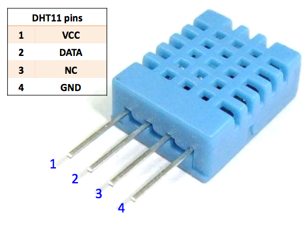
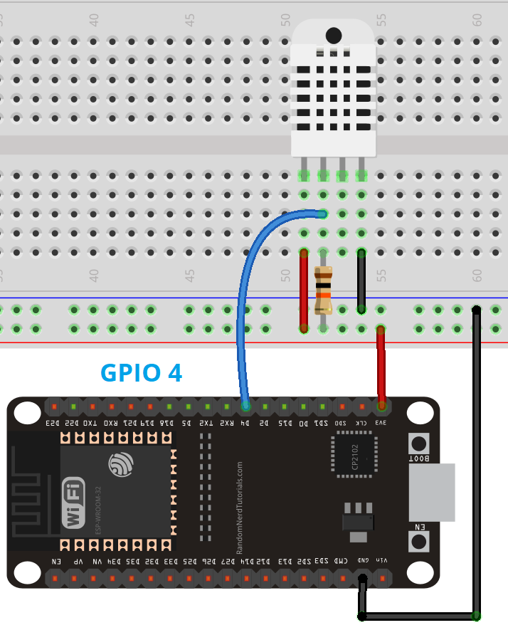
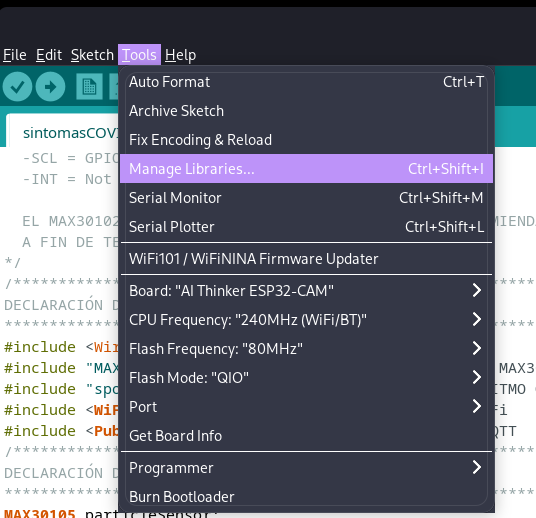
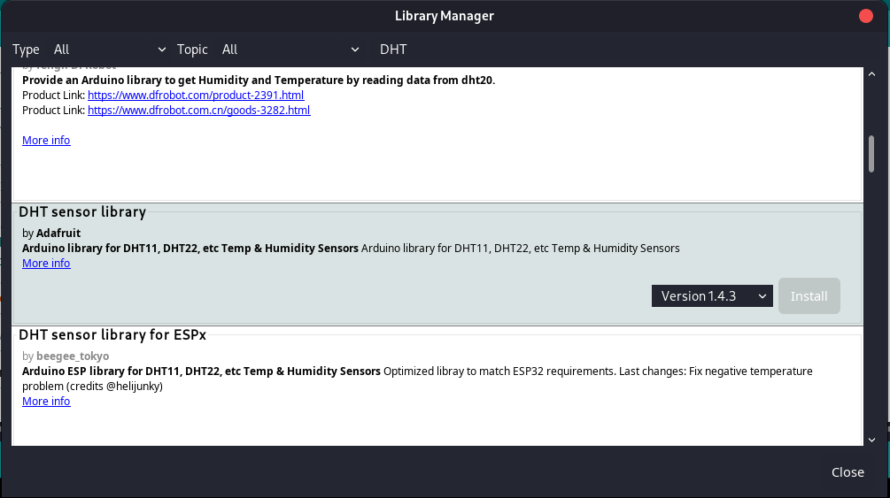
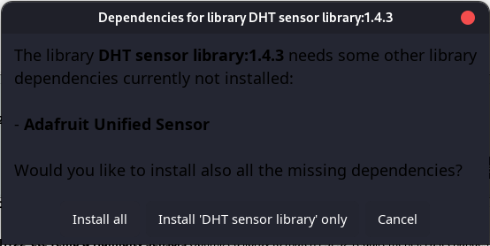

# Lectura de Temperatura y Humedad con el DHT-11 usando el ESP32CAM
## Descripcion
Este programa realiza lecturas de temperatura y humedad ambiental haciendo uso del sensor DHT11, manejado mediante un ESP32CAM, para posteriormente publicar los resultados mediante MQTT en un tema especifico.
## Materiales
- ESP32CAM
- DHT-11
- FTDI/Modulo programador
- 3 LED's (opcional)
- 1 resistencia de 10K ohm.
## Software necesario 
Visita el siguiente enlace: [software necesario](https://github.com/JorgeIsur/ESP32CAM-PROJECTS/tree/master/MAX30102/SintomasCovid/sintomasCOVID#software-necesario)
## Instalacion del soporte para ESP32CAM en Arduino IDE
Visita el siguiente enlace: [soporte esp32cam](https://github.com/JorgeIsur/ESP32CAM-PROJECTS/tree/master/MAX30102/SintomasCovid/sintomasCOVID#instalaci%C3%B3n-del-soporte-para-esp32cam-en-arduino-ide)
## Conexiones FTDI
Visitar el siguiente enlace: [FTDI](https://github.com/JorgeIsur/ESP32CAM-PROJECTS/tree/master/MAX30102/SintomasCovid/sintomasCOVID#ftdi)
## Circuito
Para facilitar la realizacion del circuito, te mostrare los pines de cada elemento necesario.
- ESP32CAM 
- DHT-11 

Ahora las conexiones serian las siguientes:

| DHT11 | ESP32CAM |
|-------|----------|
|   1   |   3.3V   |
|   2   |   GPIO2  |
|   3   |  No se conecta|
|   4   | GND|

En caso de querer utilizar LED's, estos deberan ser conectados de la siguiente manera,aunque usarlos es por mera estetica y no afecta el funcionamiento.

| LED     | ESP32CAM|
|---------|---------|
| Rojo    | GPIO15  |
| Amarillo   | GPIO14|
| Verde     |  GPIO13|

Hay que recordar que la mayoria de conexiones a pines GPIO estan definidas por software, y que pueden ser modificadas desde el codigo fuente de acuerdo a tus necesidades.

Para la conexion de la resistencia, tomemos el siguiente ejemplo:

Donde la resistencia de 10K se conecta al Pin 2 del DHT11 hacia 3.3v.

| 10K Ohm|ESP32CAM|
|--------|--------|
|Pin 2 DHT11| 3.3v|

## Instalando librerias en Arduino IDE.
Para manipular el sensor DHT11 instalaremos la siguiente libreria de AdaFruit:

- Seleccionamos 'tools' o 'Herramientas' dependiendo del idioma y posteriormente seleccionamos 'Manage libraries' o 'administrador de librerias' en español. 
- Una vez dentro del administrador de librerias, buscaremos la palabra 'DHT' y en los resultados instalaremos la siguiente libreria. 
- Al intentar instalarla nos aparecera el siguiente aviso, preguntando si queremos instalar las dependencias de la propia libreria, o solamente la libreria, de cualquier manera seleccionaremos instalar las dependencias ya que sin ellas la libreria antes mencionada no funcionara, asi que seleccionamos 'install all'. 

Tambien vamos a necesitar instalar la libreria necesaria para el manejo de conexiones MQTT, para ello, visita el siguiente enlace: [libreria mqtt](https://github.com/JorgeIsur/ESP32CAM-PROJECTS/tree/master/MAX30102/SintomasCovid/sintomasCOVID#instalar-biblioteca-para-el-manejo-de-funciones-mqtt)

## Ahora solo queda cargar el codigo.