# Capstone-project 
## Administrador de Laboratorios.
## Descripción.
En este repositorio encontraras los recursos necesarios para la creación de un sistema de administración de acceso y monitoreo de laboratorios en el cual se usarán un conjunto de sensores los cuales serán leídos mediante un arreglo de ESP32-CAM y Raspberrypi 3, donde dependiendo del número de laboratorios/salones se determinará la cantidad de microcontroladores/microcomputadoras.
## Dispositivos
- Raspberry Pi 3 Model B+
  
  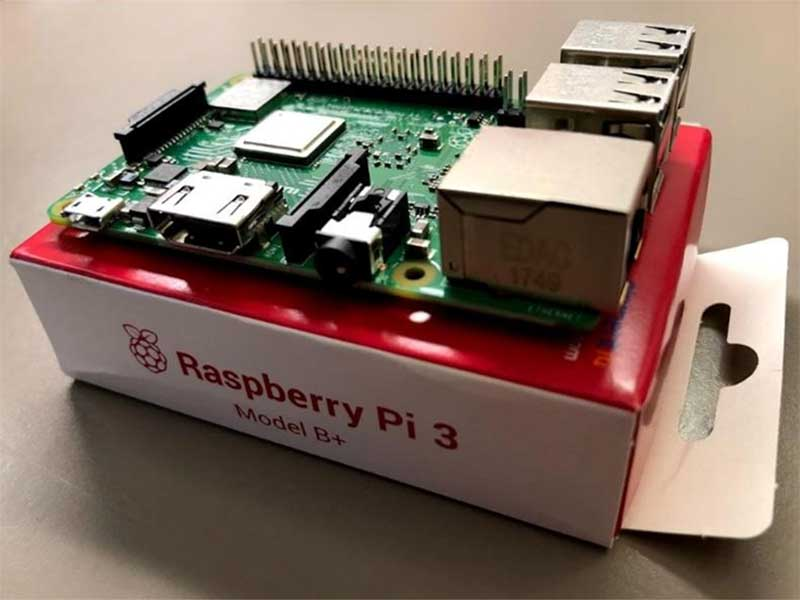
- ESP32Cam
  
  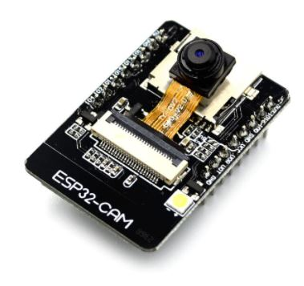
## Sensores y Actuadores.
- DHT11
  
  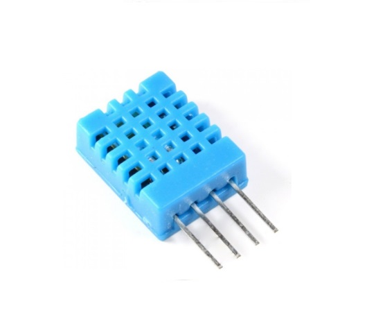
- MAX30102
  
  
- MLX90614
  
  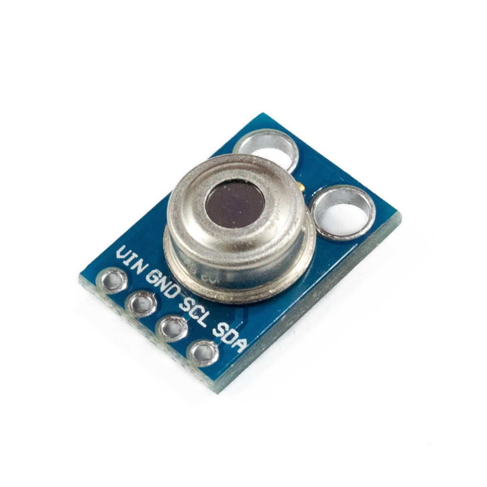
- PN532
  
  
- Micro Servo 9g
  
  
## Lista de contenidos
- [DHT11](https://github.com/ElierRosales/Capstone-project-Administrador-de-laboratorios/tree/main/DHT11)
- [MAX30102](https://github.com/ElierRosales/Capstone-project-Administrador-de-laboratorios/tree/main/MAX30102)
- [MLX90614](https://github.com/ElierRosales/Capstone-project-Administrador-de-laboratorios/tree/main/MLX90614)
- [PN532](https://github.com/ElierRosales/Capstone-project-Administrador-de-laboratorios/tree/main/PN532)
- [Servomotor](https://github.com/ElierRosales/Capstone-project-Administrador-de-laboratorios/tree/main/Servo%20Motor)
- [MongoDB](https://github.com/ElierRosales/Capstone-project-Administrador-de-laboratorios/tree/main/MongoDB)
- [Node-red](https://github.com/ElierRosales/Capstone-project-Administrador-de-laboratorios/tree/main/Node-red)
## Modo de uso.
Una vez programado todos los sensores y dispositivos, tenemos que registrar alguna de las tarjetas en la base de datos manualmente, visitar: [registrarBaseDatos.py](https://github.com/ElierRosales/Capstone-project-Administrador-de-laboratorios/tree/main/MongoDB#descripcion-de-los-programas-en-este-repositorio)

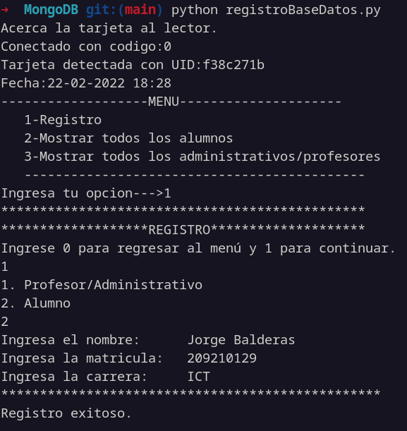

Hecho esto, el usuario debe pasar su tarjeta por el sensor NFC [PN532](https://github.com/ElierRosales/Capstone-project-Administrador-de-laboratorios/tree/main/PN532), el cual leera el UID(ID Único) de la tarjeta en cuestión, y lo enviará mediante MQTT a el tema 'isur/uid' del broker utilizado.

El programa [buscarUID.py](https://github.com/ElierRosales/Capstone-project-Administrador-de-laboratorios/tree/main/MongoDB#descripcion-de-los-programas-en-este-repositorio) recibirá el UID enviado anteriormente, y buscará en la base de datos el usuario al que le pertenece la tarjeta, una vez encontrado mostrará los datos en la pantalla de la terminal, además de enviar los datos del usuario mediante MQTT para que posteriormente sean mostrados en el dashboard.

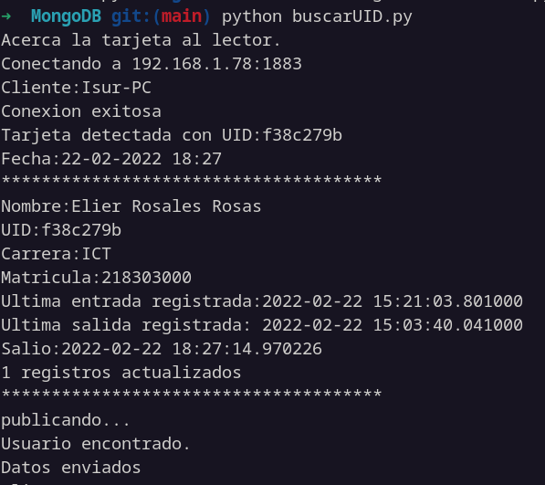

Aquí podemos ver como también se registra la última hora de entrada o salida, además de decirnos si el usuario salió o entró. Una vez enviados los datos, el sistema regresa automáticamente a escuchar en el tema 'isur/uid' en espera de otra tarjeta. En caso de que la UID que se reciba no se encuentra en el sistema, el sistema simplemente no publicará nada.

El siguiente paso es el dashboard de [node-red](https://github.com/ElierRosales/Capstone-project-Administrador-de-laboratorios/tree/main/Node-red), diseñado especificamente para reducir lo más posible la intervención de personal en el sistema de acceso.

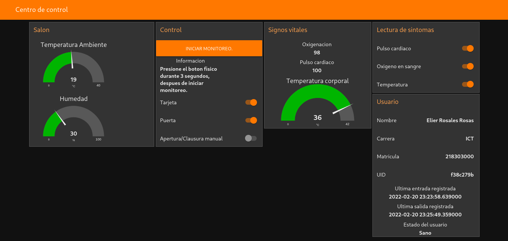

El dashboard además, esta diseñado para darnos información sobre el salón, tales como la temperatura en el interior y el porcentaje de humedad.

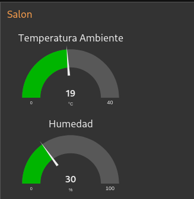

Mientras que en la sección de 'Control se concentra en darnos información sobre algunos procesos en segundo plano, además de disparar el monitoreo mediante un botón, el cúal solo debe ser pulsado una sola vez en cada encendido, esto debido a que dispara un script en python para medir la temperatura, y los scripts que hacen uso de alguna interfaz (i2c,GPIO) no pueden ser disparados cada que se enciende la raspberry de manera automática.

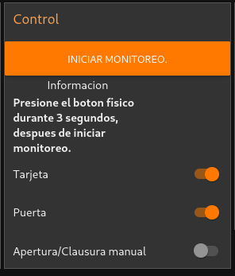

A su vez, nos muestra un switch que se activa cada que se detecta una tarjeta en el sensor, otro switch que nos avisa el estado de la puerta (abierta/cerrada) y finalmente un switch para poder abrir o cerrar la puerta manualmente en caso de emergencia o mal funcionamiento del dispositivo.

Después, tenemos la sección de 'Signos vitales', donde se mostrarán los mensajes enviados por el sistema de detección de sintomas de COVID-19, compuesto por el MLX90614(Conectado a una RaspberryPi) y un MAX30102(Conectado a un ESP32Cam) sincronizados mediante un 'push button'.

La función del botón es disparar el modo lectura de ambos sensores, ya que están programados de tal manera que mientras no se presione el botón por al menos 3 segundos, entren en un modo standby.
- Modo standby MLX90614.
  
  

  En este modo también se muestra una pequeña interfaz de texto mostrando la fecha y hora en terminal, de tal manera que se le podría añadir un pequeño display LCD de 16x2 para mostrar esta interfaz a futuro.
- Modo standby MAX30102.
  
  

Una vez presionado el botón durante 3 segundos, ambos sensores deben entrar en modo lectura.
- Modo lectura MLX90614
  
  
- Modo lectura MAX30102
  
  

Es normal que el MLX90614 termine primero, ya que realiza las lecturas muy rápido, el MLX90614 realiza una lectura de la temperatura corporal, mientras que el MAX30102 realiza lecturas de oxigeno en sangre y pulso cardiaco.

El MAX30102 también es capaz de realizar lecturas de temperatura, pero al realizar distintas pruebas con ambos sensores nos dimos cuenta que el MLX90614 es mucho más preciso.

Una vez terminada las lecturas, cada sensor envía sus resultados a los distintos temas, 'isur/temp','isur/oxigeno','isur/pulso', para ser mostradas en la sección antes mencionada de 'Signos vitales'

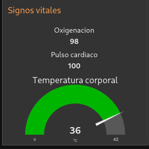

**NOTA:** 

Debido a la carencia de condiciones de laboratorio, es probable que este tipo de sensores puedan enviar lecturas erroneas, especialmente el MAX30102, por lo tanto es recomendable que si detectamos alguna lectura 'sospechosa' realicemos la lectura una vez más.

Ahora en la sección de lectura de sintomas, se muestran las lecturas que realizamos, ya que cada switch se activa con la llegada de un mensaje en cada tema, por lo tanto si algún switch no se activará, eso significaría que el mensaje en ese tema no se pudo publicar y nos ayudaría a resolver el mal funcionamiento de manera más rápida.

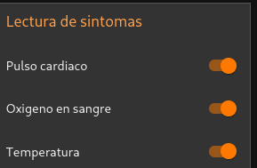

La sección de 'usuario' esta dedicada a mostrar la información extraida de la base de datos por el programa en Python y recibida mediante MQTT

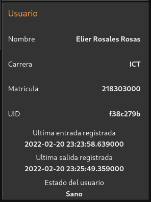

También podemos notar el campo de 'Estado del Usuario', el cual no se recibe desde la base de datos, tampoco mediante MQTT, este campo de texto oscila entre 'Sano' y 'Enfermo' dependiendo de los sintomas recibidos en la sección de 'Signos vitales', siendo Node-red mismo quien hace las comparaciones para decidir si el usuario esta enfermo o sano.

En caso de que el estado del usuario sea 'Sano', este envía una señal **True** mediante MQTT a la puerta (en este caso, un servomotor) para que se abra, por otra parte, si el estado del usuario es 'Enfermo' enviará una señal **False**, lo cúal no abrirá la puerta, y la cerrará en dado caso de que este abierta.